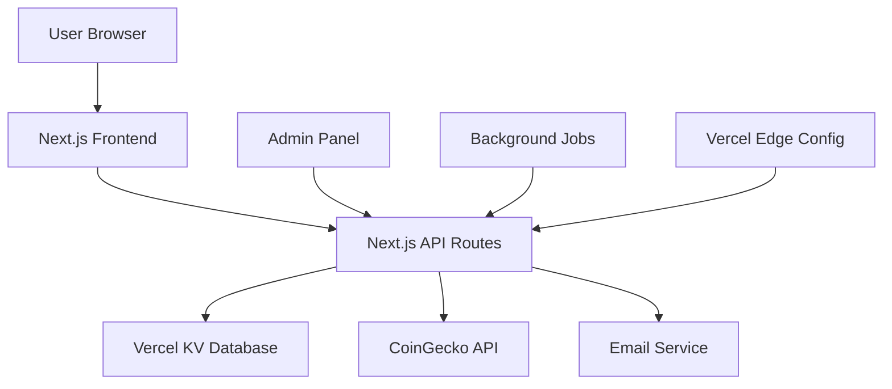

# PLANNING.md - CoinSpree Project Planning

## 🎯 Project Vision

### Mission Statement

Create a reliable, real-time cryptocurrency All-Time High (ATH) notification service that empowers crypto traders to maximize their bull market opportunities through timely alerts and actionable insights.

### Target Outcome

A profitable SaaS platform with 1000+ users and 20%+ subscription conversion rate, providing instant ATH notifications for the top 100 cryptocurrencies with 100% detection accuracy.

### Core Value Proposition

- **Real-time ATH Detection**: Never miss a new all-time high
- **Subscription-based Access**: Quality service with sustainable revenue
- **Trader-focused**: Built specifically for bull market profit-taking
- **Reliable Infrastructure**: 99.9% uptime on Vercel platform

## 🏗️ System Architecture

### High-Level Architecture



### Component Architecture

```
┌─────────────────┐    ┌─────────────────┐    ┌─────────────────┐
│   Frontend      │    │   Backend       │    │   External      │
│                 │    │                 │    │                 │
│ • Dashboard     │◄───│ • API Routes    │◄───│ • CoinGecko API │
│ • Auth Pages    │    │ • Middleware    │    │ • Email Service │
│ • Admin Panel   │    │ • Background    │    │ • USDT Network  │
│ • Profile       │    │   Jobs          │    │                 │
└─────────────────┘    └─────────────────┘    └─────────────────┘
         │                       │                       │
         ▼                       ▼                       ▼
┌─────────────────┐    ┌─────────────────┐    ┌─────────────────┐
│ State Mgmt      │    │ Data Layer      │    │ Configuration   │
│                 │    │                 │    │                 │
│ • React Hooks   │    │ • Vercel KV     │    │ • Edge Config   │
│ • Context API   │    │ • Data Models   │    │ • Env Variables │
│ • Local State   │    │ • Validation    │    │ • App Settings  │
└─────────────────┘    └─────────────────┘    └─────────────────┘
```

### Data Flow Architecture

1. **Crypto Data Pipeline**:
   - CoinGecko API → Cache in Vercel KV → ATH Detection → Email Notifications
2. **User Authentication**:
   - Login → Session Creation → Middleware Validation → Protected Routes
3. **Subscription Flow**:
   - USDT Payment → Manual Verification → Subscription Activation → Notification Access

## 🛠️ Technology Stack

### Frontend Technologies

- **Framework**: Next.js 14+ with App Router
  - Server-side rendering for SEO
  - Client-side routing for SPA experience
  - Built-in optimization and performance
- **Styling**: Tailwind CSS
  - Utility-first CSS framework
  - Mobile-first responsive design
  - Dark/light theme support
- **State Management**: React Built-in Hooks
  - `useState` for component state
  - `useReducer` for complex state logic
  - `useContext` for global state sharing
- **Validation**: Zod
  - Type-safe schema validation
  - Form validation
  - API request/response validation

### Backend Technologies

- **API Layer**: Next.js API Routes
  - Serverless functions on Vercel
  - Edge functions for real-time operations
  - Built-in TypeScript support
- **Authentication**: Next.js Middleware
  - Custom authentication logic
  - Secure HTTP-only cookies
  - Route protection
- **Background Processing**: Vercel Cron Jobs
  - Scheduled ATH checking
  - Cleanup operations
  - Subscription management

### Database & Storage

- **Primary Database**: Vercel KV (Redis)
  - Fast key-value storage
  - Built-in caching capabilities
  - Serverless-optimized
- **Configuration**: Vercel Edge Config
  - Global configuration constants
  - Feature flags
  - Email templates
- **Session Storage**: Encrypted Cookies
  - Secure session management
  - CSRF protection
  - HttpOnly and Secure flags

### External Integrations

- **Crypto Data**: CoinGecko Free API
  - Top 100 cryptocurrencies
  - Market data and ATH tracking
  - Rate-limited to 50 calls/minute
- **Email Service**: Resend (Vercel-compatible)
  - Transactional emails
  - High deliverability rates
  - Template support
- **Payment Tracking**: Tron Network USDT
  - Manual payment verification
  - Transaction hash validation
  - Blockchain integration

### DevOps & Deployment

- **Hosting**: Vercel Platform
  - Automatic HTTPS
  - Global CDN
  - Edge caching
- **CI/CD**: Vercel Git Integration
  - Automatic deployments
  - Preview deployments
  - Environment management
- **Monitoring**: Vercel Analytics
  - Performance monitoring
  - Error tracking
  - Usage analytics

## 📊 Data Models & Schema

### Core Entities

```typescript
// User Management
interface User {
  id: string
  email: string
  passwordHash: string
  role: 'user' | 'admin'
  isActive: boolean
  createdAt: string
  lastLogin: string
  notificationsEnabled: boolean
}

// Subscription System
interface Subscription {
  id: string
  userId: string
  status: 'active' | 'expired' | 'blocked'
  startDate: string
  endDate: string
  paymentTxHash: string
  amount: number
}

// Cryptocurrency Data
interface CryptoAsset {
  id: string
  symbol: string
  name: string
  currentPrice: number
  marketCap: number
  marketCapRank: number
  ath: number
  athDate: string
  lastUpdated: string
}

// Notification System
interface NotificationLog {
  id: string
  cryptoId: string
  newATH: number
  previousATH: number
  sentAt: string
  recipientCount: number
}
```

### Database Keys Strategy (Vercel KV)

```
Users: user:{id}, users:all, user:email:{email}
Subscriptions: subscription:{id}, user:subscription:{userId}
Crypto: crypto:{id}, crypto:top100, crypto:ath:{id}
Notifications: notification:{id}, notifications:log
Sessions: session:{sessionId}
Config: app:config, email:templates
```

## 🔄 System Workflows

### 1. ATH Detection Workflow

```
┌─────────────┐    ┌─────────────┐    ┌─────────────┐    ┌─────────────┐
│ Fetch from  │───►│ Compare     │───►│ Detect New  │───►│ Send Email  │
│ CoinGecko   │    │ with Stored │    │ ATH         │    │ Alerts      │
│ API         │    │ ATH Values  │    │             │    │             │
└─────────────┘    └─────────────┘    └─────────────┘    └─────────────┘
       │                   │                   │                   │
       ▼                   ▼                   ▼                   ▼
┌─────────────┐    ┌─────────────┐    ┌─────────────┐    ┌─────────────┐
│ Cache in    │    │ Update KV   │    │ Log         │    │ Update User │
│ Vercel KV   │    │ Database    │    │ Detection   │    │ Preferences │
└─────────────┘    └─────────────┘    └─────────────┘    └─────────────┘
```

### 2. User Subscription Workflow

```
┌─────────────┐    ┌─────────────┐    ┌─────────────┐    ┌─────────────┐
│ User Pays   │───►│ Automated   │───►│ Subscription│───►│ Enable      │
│ USDT on     │    │ Tron        │    │ Activated   │    │ Notifications│
│ Tron        │    │ Verification│    │ Instantly   │    │             │
└─────────────┘    └─────────────┘    └─────────────┘    └─────────────┘
       │                   │                   │                   │
       ▼                   ▼                   ▼                   ▼
┌─────────────┐    ┌─────────────┐    ┌─────────────┐    ┌─────────────┐
│ Submit TX   │    │ Validate    │    │ Create      │    │ Admin Can   │
│ Hash to     │    │ Amount &    │    │ Subscription│    │ Override    │
│ System      │    │ Contract    │    │ Record      │    │ Via Dashboard│
└─────────────┘    └─────────────┘    └─────────────┘    └─────────────┘
```

### 3. Authentication Workflow

```
┌─────────────┐    ┌─────────────┐    ┌─────────────┐    ┌─────────────┐
│ User Login  │───►│ Validate    │───►│ Create      │───►│ Set Secure  │
│ Credentials │    │ Password    │    │ Session     │    │ Cookie      │
└─────────────┘    └─────────────┘    └─────────────┘    └─────────────┘
```

## 🎯 Required Tools & Setup

### Development Environment

```bash
# Required Node.js version
node >= 18.17.0

# Package manager
npm >= 9.0.0

# Development tools
git >= 2.34.0
```

### Essential Dependencies

```json
{
  "dependencies": {
    "next": "^14.0.0",
    "react": "^18.0.0",
    "react-dom": "^18.0.0",
    "tailwindcss": "^3.3.0",
    "zod": "^3.22.0",
    "bcryptjs": "^2.4.3",
    "@vercel/kv": "^1.0.0",
    "@vercel/edge-config": "^1.0.0",
    "resend": "^2.0.0"
  },
  "devDependencies": {
    "@types/node": "^20.0.0",
    "@types/react": "^18.0.0",
    "typescript": "^5.0.0",
    "eslint": "^8.0.0",
    "eslint-config-next": "^14.0.0"
  }
}
```

### Environment Variables

```env
# Required for production
VERCEL_KV_URL=
VERCEL_KV_REST_API_URL=
VERCEL_KV_REST_API_TOKEN=
EDGE_CONFIG=

# Application secrets
NEXTAUTH_SECRET=
PASSWORD_SALT_ROUNDS=12

# External APIs
COINGECKO_API_KEY= (optional for higher limits)
RESEND_API_KEY=

# App configuration
SUBSCRIPTION_PRICE_USDT=50
SUBSCRIPTION_DURATION_DAYS=30
TRON_WALLET_ADDRESS=
```

### Vercel Setup Requirements

1. **Vercel KV Database**
   - Create KV instance in Vercel dashboard
   - Configure environment variables
   - Set up data retention policies

2. **Vercel Edge Config**
   - Create Edge Config for app settings
   - Store email templates
   - Configure feature flags

3. **Domain & SSL**
   - Custom domain setup
   - Automatic HTTPS certificate
   - CDN configuration

### External Service Setup

1. **CoinGecko API**
   - Free tier: 50 calls/minute
   - Optional: Pro plan for higher limits
   - API documentation: https://www.coingecko.com/api/documentations/v3

2. **Resend Email Service**
   - Account setup and API key
   - Domain verification for custom emails
   - Email template configuration

3. **Tron Network Monitoring**
   - USDT wallet address setup
   - Transaction monitoring strategy
   - Manual verification process

## 📈 Performance Targets

### Speed Benchmarks

- **Initial Page Load**: < 2 seconds
- **Subsequent Navigation**: < 500ms
- **API Response Time**: < 300ms
- **Database Queries**: < 100ms
- **Email Delivery**: < 30 seconds

### Scalability Targets

- **Concurrent Users**: 1,000+
- **API Requests**: 10,000/hour
- **Email Volume**: 50,000/month
- **Database Operations**: 100,000/day

### Reliability Targets

- **Uptime**: 99.9%
- **ATH Detection Accuracy**: 100%
- **Email Delivery Rate**: 99%+
- **Error Rate**: < 0.1%

## 🚀 Launch Strategy

### Phase 1: MVP Development (Weeks 1-4)

- Core authentication system
- Basic crypto data display
- Simple subscription management
- Email notification system

### Phase 2: Feature Enhancement (Weeks 5-6)

- Admin panel development
- Advanced notification controls
- Performance optimization
- Security hardening

### Phase 3: Testing & Deployment (Weeks 7-8)

- Comprehensive testing
- Performance benchmarking
- Security audit
- Production deployment

### Phase 4: Post-Launch (Ongoing)

- User feedback integration
- Performance monitoring
- Feature iterations
- Scale optimization

## 🎯 Success Metrics

### Technical KPIs

- Zero missed ATH detections
- 99.9% system uptime
- < 2 second page load times
- 99%+ email delivery success

### Business KPIs

- 1,000+ registered users (3 months)
- 20%+ subscription conversion rate
- 80%+ monthly user retention
- $10,000+ monthly recurring revenue

---

**Remember**: This planning document should guide every development decision. Always refer back to ensure alignment with the project vision and technical constraints.
